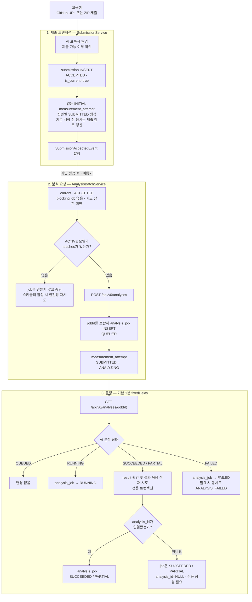
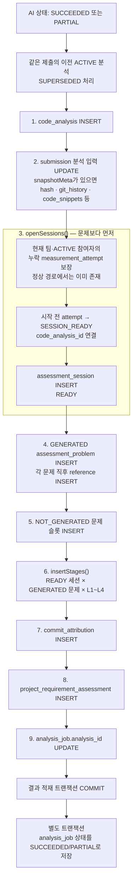
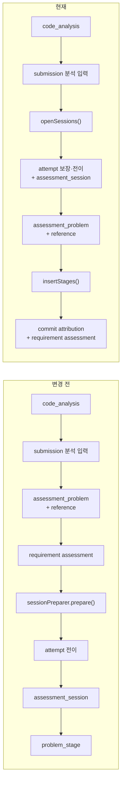
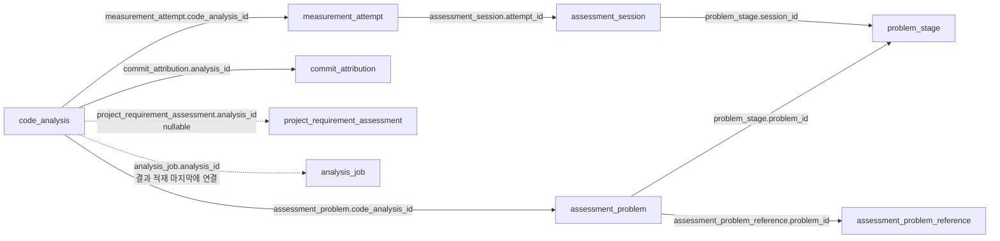
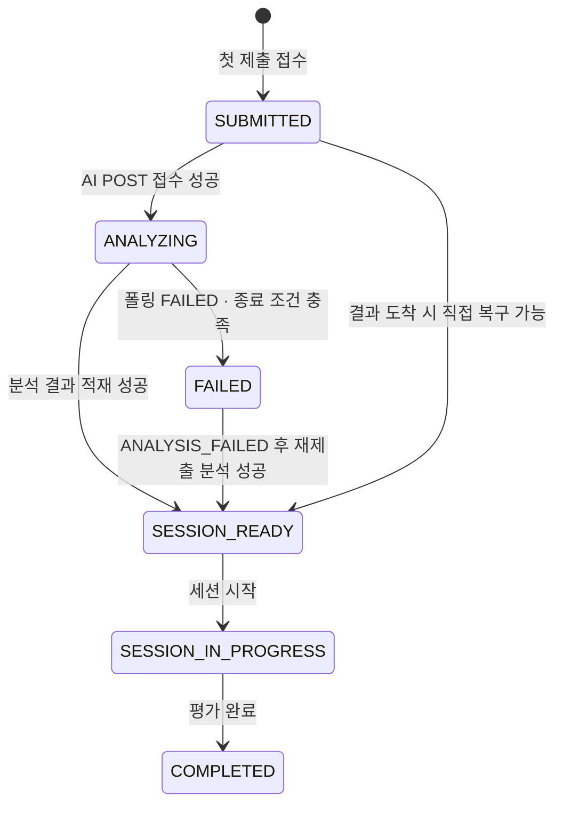

# 코드 제출 → AI 분석 → 평가 세션 준비 흐름

**대상:** 백엔드·AI·프론트 협업자  
**기준:** 2026-08-11 현재 구현

> 한 줄 요약: **제출과 분석은 팀 단위**, **응시와 세션은 팀원 개인 단위**다.  
> 제출할 때 팀원별 응시를 먼저 만들고, 분석이 끝나면 팀 공통 문제를 각 개인 세션의 L1~L4 단계로 펼친다.

---

## 1. 먼저 알아둘 핵심 원장

| 원장 | 단위 | 역할 | 생성·갱신 시점 |
|---|---|---|---|
| `submission` | 팀 | 어떤 코드 또는 ZIP을 제출했는지 보관 | 제출 트랜잭션 |
| `measurement_attempt` | 팀원 개인 | 개인별 응시 상태와 어떤 제출·분석을 사용하는지 보관 | 제출 시 없는 INITIAL 응시 생성, 이후 참조·상태 갱신 |
| `analysis_job` | 분석 실행 1회 | AI 요청·폴링 상태와 실패 사유를 추적 | AI 호출 직전 생성 |
| `code_analysis` | 팀 분석 결과 1건 | 분석 결과의 루트 원장 | AI 분석 성공·부분 성공 후 |
| `assessment_problem` | 팀 공통 문제 | 생성된 문제 또는 생성하지 못한 문제 슬롯 | 결과 적재 중 |
| `assessment_session` | 팀원 개인 | 교육생 한 명의 실제 평가 세션 | 결과 적재 중 |
| `problem_stage` | 개인 세션 × 문제 × 축 | 개인이 풀 L1~L4 질문과 힌트 | 세션과 문제가 모두 생긴 뒤 |

가장 자주 헷갈리는 구분은 다음 두 가지다.

- `analysis_job`은 **실행 상태 원장**이다. 분석 중이거나 실패해도 존재한다.
- `code_analysis`는 **성공 결과 원장**이다. 결과 적재에 성공해야 존재한다.

---

## 2. 전체 흐름 한눈에 보기



`SubmissionAcceptedEvent`는 제출 메서드 안에서 발행되지만, 실제 리스너는 `AFTER_COMMIT`에서 비동기로 실행된다. 따라서 제출 트랜잭션이 롤백되면 AI 분석은 시작되지 않는다.

> 운영 환경에서 폴링·안전망 스케줄러를 사용하려면 `ai.analysis.scheduler.enabled=true`가 필요하다. 기본값은 `false`다.

---

## 3. 단계별 설명

### 3.1 제출: 팀 제출과 개인 응시를 함께 연다

`SubmissionService.submitGithubUrl()`과 `submitZip()`은 하나의 DB 트랜잭션으로 동작한다.

1. AI 프록시를 깨우고 제출 가능한 회차·제출 방식을 확인한다.
2. 재제출이면 이전 `submission.is_current`를 `false`로 바꾼다.
3. 새 `submission`을 `ACCEPTED`, `is_current=true`로 저장한다.
4. 현재 팀 배정과 ACTIVE 프로젝트 참여를 가진 팀원 중 `INITIAL measurement_attempt`가 없는 사람은 `SUBMITTED`로 열고, 기존 시작 전 응시는 새 제출을 가리키게 한다.
5. `SubmissionAcceptedEvent`를 발행한다.

응시를 분석 성공 시점이 아니라 **제출 시점에 만드는 이유**는 명확하다.

- 분석이 오래 걸려도 교육생 화면에 `제출함`과 `분석 중`을 표시할 수 있다.
- 분석이 실패해도 응시 원장이 남아, `미응시`와 `분석 실패로 응시 불가`를 구분할 수 있다.
- 팀 제출 하나를 팀원별 개인 세션으로 연결할 출발점이 생긴다.

재제출이라고 응시를 무조건 새로 만들지는 않는다. 회차·사용자당 `INITIAL` 응시는 하나이므로, 시작 전 상태인 기존 응시의 `source_submission_id`만 새 제출로 바꾼다. 이미 세션을 시작했거나 종료한 응시는 되돌리지 않는다.

ZIP 본체 저장은 DB 트랜잭션 자원이 아니다. 파일 저장 뒤 DB 작업이 롤백되면 참조되지 않는 저장 객체가 남을 수 있다.

### 3.2 분석 요청: AI 작업 ID를 받은 뒤 로컬 job을 한 번만 저장한다

커밋 후 비동기 리스너가 `AnalysisBatchService.dispatchSubmission()`을 호출한다.

1. 현재 `ACCEPTED` 제출인지, 디스패치를 막는 job이 없는지, 총 시도 상한 미만인지 확인한다. 진행·성공 job과 비재시도 실패 job은 새 요청을 막는다.
2. 사용할 ACTIVE AI 모델과 회차의 `teaches`를 먼저 확정한다.
3. 두 값 중 하나라도 없으면 `analysis_job`도 만들지 않고 중단한다.
4. AI 서버에 `POST /api/v0/analyses`를 보낸다.
5. 응답의 외부 작업 ID를 넣은 `analysis_job`을 `QUEUED`로 한 번 INSERT한다.
6. 시작 전 개인 응시를 `ANALYZING`으로 전이한다.

정상 접수 건을 AI 호출보다 먼저 저장하지 않는 이유는, `external_job_id=NULL`인 활성 행이 DB에 존재하는
창을 없애기 위해서다. AI가 202를 반환한 직후 프로세스가 종료돼 INSERT하지 못하더라도 안전망은 같은
`submissionId:executionNo` 멱등키로 다시 요청한다. AI가 기존 작업 ID를 다시 반환하면 그 ID를 포함해 원장을 복구한다.
요청 자체가 실패한 경우에는 외부 ID 없는 `FAILED` 행만 저장해 실패 이력을 남긴다.

이 구간 전체를 하나의 트랜잭션으로 묶지는 않는다. 외부 HTTP 호출 동안 DB 커넥션을 점유하지 않는다.
AI가 202를 반환해도 job 상태는 아직 `QUEUED`이며, 폴링에서 실제 `RUNNING` 응답을 받아야 `RUNNING`이 된다.

### 3.3 폴링: HTTP와 DB 쓰기를 분리한다

`AnalysisJobScheduler`는 활성화된 경우 기본 1분 간격으로 `QUEUED`, `RUNNING` job을 조회한다.

현재 `pollActiveJobs()` **전체에는 `@Transactional`이 없다.** 대신 다음 쓰기 단위가 각각 독립 트랜잭션이다.

| 쓰기 단위 | 실패했을 때 영향 |
|---|---|
| AI 사용량 적재 | 사용량 묶음만 롤백 |
| 분석 결과 전체 적재 | 결과 묶음만 전부 롤백 |
| 최종 `analysis_job` 상태 저장 | job 상태 저장만 실패 |
| 최종 분석 실패 시 응시 종료 처리 | 응시 상태 처리만 실패 |

이 구조 덕분에 한 job의 제약 위반이 같은 회차에 폴링한 다른 job까지 전부 롤백시키지 않는다. AI 서버로 보내는 GET 요청도 트랜잭션 밖에서 실행된다.

---

## 4. SUCCEEDED/PARTIAL 결과 적재 순서

결과 적재는 `JdbcAnalysisResultRepository.record()`가 맡는다. 아래 그림은 `result`가 있고 모든 SQL이 성공하는 **정상 적재 경로**다. 묶음은 하나의 전용 트랜잭션에서 처리되어, 중간 SQL이 실패하면 전체가 함께 롤백된다.



정상 경로에서는 `measurement_attempt`가 제출 시점에 이미 존재한다. 다만 현재 `openSessions()`는 **현재 팀 배정과 ACTIVE 프로젝트 참여자**의 응시가 누락됐으면 복구 안전망으로 `SESSION_READY` 응시를 직접 만든다. `SESSION_IN_PROGRESS`·`COMPLETED`·`EXPIRED`와 분석 이외 사유로 종료된 응시는 건드리지 않으며, `FAILED / ANALYSIS_FAILED`만 성공한 재분석에서 복구한다. 따라서 정확한 표현은 **“제출 시 생성이 원칙이고, 분석 적재 시 대상 팀원의 시작 전 응시 존재를 다시 보장한다”**다.

`analysis_job.analysis_id`를 결과 트랜잭션 안에서 먼저 연결하는 이유는 중복 적재 방지다. 결과 적재는 성공했지만 마지막 job 상태 저장만 실패한 경우, 다음 폴링은 이미 연결된 `analysis_id`를 보고 문제를 다시 INSERT하지 않는다.

반대로 성공 응답에 `result`가 없거나 결과 적재가 실패하면 job 상태는 AI의 사실대로 `SUCCEEDED/PARTIAL`로 저장되지만 `analysis_id`는 `NULL`이다. 이 조합은 자동 재적재·재분석되지 않으므로 수동 복구가 필요한 장애 신호다.

---

## 5. 무엇이 바뀌었는가



| 변경점 | 이전 | 현재 | 이유 |
|---|---|---|---|
| 모델·교안 확인 | job 생성 뒤 실패할 수 있음 | 모델과 `teaches`를 job보다 먼저 확정 | 설정 문제 때문에 재시도 불가능한 job 행이 남는 것을 방지 |
| 세션 준비 위치 | 문제 적재 뒤 `prepare()` 한 번 | 문제 적재 전 `openSessions()` | 세션 생성 시 필수 FK는 응시뿐이므로 문제를 기다릴 이유가 없음 |
| 단계 생성 책임 | `prepare()` 안에 숨겨짐 | `insertStages()`로 분리 | `problem_stage`가 세션과 문제 둘 다 필요하다는 의존성을 코드에 드러냄 |
| 누락 응시 처리 | 전이 0건이면 세션도 0건 | `openSessions()`가 대상 팀원의 누락 응시를 복구 | “문제는 있는데 개인 세션은 없음” 상태 방지 |
| 폴링 트랜잭션 | 폴링 회차 전체가 한 트랜잭션 | HTTP는 밖, 쓰기는 독립 트랜잭션 | 한 job 실패가 다른 job과 이미 적재한 결과까지 롤백시키는 문제 방지 |

변경의 핵심은 **세션과 문제를 독립된 두 갈래로 먼저 준비하고, 두 갈래가 만나는 `problem_stage`를 세션 FK 연쇄의 마지막에 만든다**는 것이다. 그 뒤에 적재하는 커밋 귀속·요구사항 판정은 세션 계보와 독립된 분석 부산물이다.

---

## 6. FK 의존성과 INSERT 순서

아래 화살표는 **부모 행 → 그 부모를 FK로 참조하는 자식 행**을 뜻한다. nullable FK를 가진 자식은 부모 없이 먼저 존재할 수 있지만, FK를 실제 값으로 연결하는 시점에는 부모가 먼저 존재해야 한다.



여기서 가장 중요한 사실은 두 가지다.

1. `assessment_session`을 생성할 때 필요한 필수 FK는 `attempt_id`뿐이다. 선택적인 `current_problem_id`와 `current_problem_stage_id`는 `NULL`로 시작하므로 문제보다 먼저 생성할 수 있다.
2. `problem_stage`는 `assessment_session`과 `assessment_problem`을 모두 참조한다. 따라서 반드시 두 행보다 나중에 생성해야 한다.

`measurement_attempt.code_analysis_id`는 분석 전에는 `NULL`일 수 있다. 제출 시에는 응시만 먼저 만들고, 분석 성공 후 `SESSION_READY`로 전이하면서 새 `code_analysis`를 연결한다.

`commit_attribution`과 현재 AI가 만드는 `project_requirement_assessment`도 `code_analysis`를 가리키지만, 세션·문제 FK에는 의존하지 않는다. 단계 뒤에 적재하는 것은 FK 강제가 아니라 핵심 세션 연쇄를 먼저 읽히게 하려는 코드 순서다. 요구사항 판정의 `analysis_id`는 수동 판정도 받을 수 있도록 DB상 nullable이다.

---

## 7. 팀 공통 데이터가 개인 데이터로 펼쳐지는 방식

`assessment_problem`은 팀이 공유하지만, `assessment_session`과 `problem_stage`는 개인별이다.

```text
problem_stage 생성 수
= READY 개인 세션 수 × 온전한 GENERATED 문제 수 × 4개 축(L1~L4)
```

예를 들어 팀원이 3명이고, AI가 문제 2개와 미매칭 개념(`unmatchedTeaches`) 1개를 반환해 백엔드가 남은 슬롯을 `NOT_GENERATED`로 만들었다면 다음과 같다.

| 테이블 | 생성 수 | 설명 |
|---|---:|---|
| `code_analysis` | 1 | 팀 분석 결과 |
| `assessment_problem` | 3 | `GENERATED` 2 + `NOT_GENERATED` 1 |
| `assessment_session` | 3 | 팀원별 1개 |
| `problem_stage` | 24 | 3명 × 2문제 × 4축 |

`NOT_GENERATED` 문제 슬롯에는 질문이 없으므로 `problem_stage`를 만들지 않는다. GENERATED 문제라도 L1~L4 질문 또는 각 축의 힌트 2개가 하나라도 빠지면 그 문제의 단계 생성을 건너뛴다.

위 수량은 예시이지 “항상 문제 3개”라는 불변식은 아니다. DB는 분석당 문제 번호를 1~3으로 제한하지만 정확히 3행을 강제하지 않는다. 백엔드도 AI가 준 `unmatchedTeaches`가 있을 때만 남는 번호를 `NOT_GENERATED`로 채운다.

---

## 8. 주요 상태 전이



- 폴링 응답에 알려진 재시도 가능 `failureCode`가 있고 횟수가 남아 있으면 응시를 곧바로 `FAILED`로 닫지 않는다.
- 폴링에서 재시도 불가능한 실패를 받았거나 시도 상한을 다 쓴 경우에 `FAILED / ANALYSIS_FAILED`로 종료한다.
- 이후 재제출 분석이 성공하면 `ANALYSIS_FAILED` 응시는 다시 `SESSION_READY`로 복구할 수 있다.

---

## 9. 운영·장애 판단 시 확인할 신호

| 상황 | 확인할 값 | 의미 |
|---|---|---|
| 분석 요청 전 중단 | `measurement_attempt=SUBMITTED`, job 없음 | 모델 또는 `teaches` 설정, 이벤트·안전망 확인 |
| AI 분석 진행 중 | job `QUEUED/RUNNING`, attempt `ANALYZING` | 정상 진행 상태 |
| 결과 적재 트랜잭션 완료 | job `SUCCEEDED/PARTIAL`, `analysis_id` 존재 | 결과 묶음이 커밋됨. 세션·문제·단계 수는 별도 확인 |
| AI는 성공했지만 결과가 없거나 적재 실패 | job `SUCCEEDED/PARTIAL`, `analysis_id IS NULL` | 자동 재처리되지 않음. 응답·DB 제약·매핑 로그 확인 |
| 문제 단계 준비 건너뜀 | 4축 또는 힌트 불완전 WARN | 해당 GENERATED 문제는 기대 단계 수 계산에서 제외 |
| 단계 수가 기대보다 적음 | 기대치 대비 INSERT 부족 ERROR | READY 세션 범위, 기존 중복 단계, INSERT 조건 확인 |

### 현재 구현에서 별도 보완이 필요한 예외 경로

| 조건 | 현재 동작 | 위험 |
|---|---|---|
| `POST /analyses` 단계에서 요청 실패 | job만 `FAILED`; 응시 종료 처리는 하지 않음 | 상한 소진 뒤에도 응시가 `SUBMITTED/ANALYZING`에 남을 수 있음 |
| 폴링 FAILED에 `failureCode`가 없거나 알 수 없음 | 응시는 즉시 `ANALYSIS_FAILED`; job에는 재시도 가능한 `MODEL_ERROR` 저장 | job 재시도 정책과 응시 상태가 서로 어긋남 |
| AI 앱 `JOB_NOT_FOUND` | 최초 시각과 연속 횟수를 애플리케이션 메모리에 기록. 연속 3회 또는 최초 응답 후 10분 중 먼저 도달하면 `TEMPORARY_ERROR`로 닫아 새 `execution_no`로 재요청 | 정상 응답 또는 백엔드 재시작 시 관측 기록 초기화. DB 스키마 변경 없음 |
| 프록시/라우터 404(HTML·빈 본문 등) | `JOB_NOT_FOUND` 횟수에 포함하지 않고 프록시 웜업 후 즉시 1회 재조회 | 재조회도 실패하면 다음 스케줄 주기에 다시 시도 |
| 여러 앱 인스턴스가 같은 job을 동시 폴링 | 조회 락과 `@Version`이 없음 | 같은 결과를 동시에 적재하려다 충돌할 수 있음 |

`QUEUED/RUNNING + external_job_id IS NULL`은 이제 정상 경로에서 생기지 않는다. **404를 받아도 `external_job_id`를 지우지 않기 때문이다(2026-08-13).** 종전에는 지웠는데, 그러면 폴링은 그 job을 건너뛰고(외부 ID가 없어 조회할 대상이 없다) 디스패치는 활성 job이라 막아서 폴링도 재요청도 되지 않는 영구 정체가 됐다. 404를 "AI 재시작으로 유실됨"의 확정 신호로 읽은 것이 전제부터 틀렸다 — 모델 실행 오류나 지연으로도 404가 난다.

여전히 이 조합이 보인다면 그건 이 변경 이전에 생긴 행이거나, 같은 DB를 보는 구버전 프로세스·수동 SQL·
DB 트리거 같은 다른 writer가 값을 지운 경우다. 현재 정상 접수 경로는 jobId를 포함한 최초 INSERT 한 번만
수행하므로 `QUEUED + external_job_id IS NULL`을 만들지 않는다. 폴러는 이런 손상 행을 실패로 닫아 반복 조회를 멈춘다.

또한 폴링 FAILED 처리에서는 응시 종료 트랜잭션이 job의 `FAILED` 저장보다 먼저다. 두 번째 저장만 실패하면 응시는 실패했는데 job은 잠시 활성 상태로 남을 수 있으므로, 독립 트랜잭션 사이의 부분 성공을 모니터링해야 한다.

---

## 10. 코드 위치

| 책임 | 구현 |
|---|---|
| GitHub·ZIP 제출 트랜잭션 | [`SubmissionService`](src/main/java/com/bigproject/backend/domain/submission/application/SubmissionService.java) |
| 팀원별 응시 생성 | [`JdbcMeasurementAttemptOpener`](src/main/java/com/bigproject/backend/domain/submission/infrastructure/JdbcMeasurementAttemptOpener.java) |
| 커밋 후 비동기 이벤트 처리 | [`SubmissionAcceptedEventListener`](src/main/java/com/bigproject/backend/domain/codeanalysis/application/SubmissionAcceptedEventListener.java) |
| 분석 요청·폴링·상태 전이 | [`AnalysisBatchService`](src/main/java/com/bigproject/backend/domain/codeanalysis/application/AnalysisBatchService.java) |
| 1분 폴링·5분 안전망 재디스패치 | [`AnalysisJobScheduler`](src/main/java/com/bigproject/backend/domain/codeanalysis/infrastructure/AnalysisJobScheduler.java) |
| 성공 결과 원장 적재 순서 | [`JdbcAnalysisResultRepository`](src/main/java/com/bigproject/backend/domain/codeanalysis/infrastructure/JdbcAnalysisResultRepository.java) |
| 응시·세션·4축 단계 준비 | [`JdbcAssessmentSessionPreparer`](src/main/java/com/bigproject/backend/domain/codeanalysis/infrastructure/JdbcAssessmentSessionPreparer.java) |
